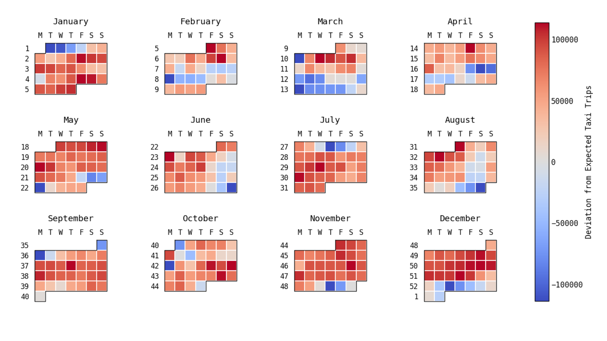
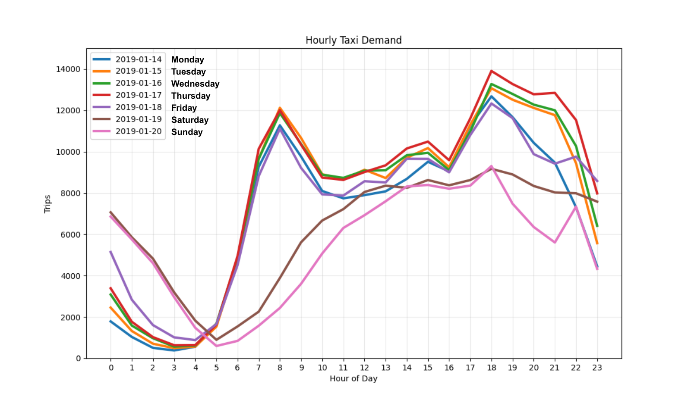
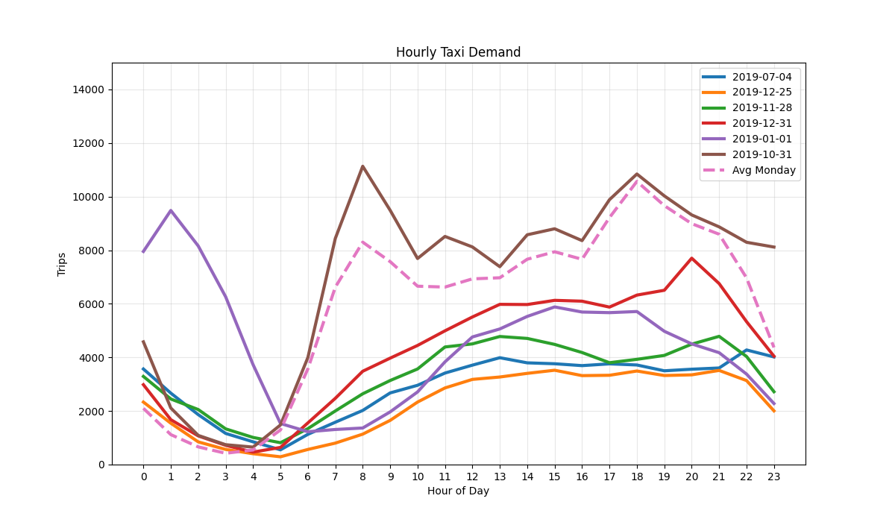
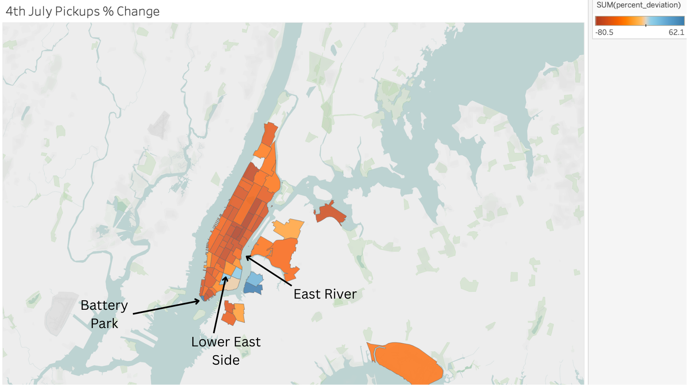
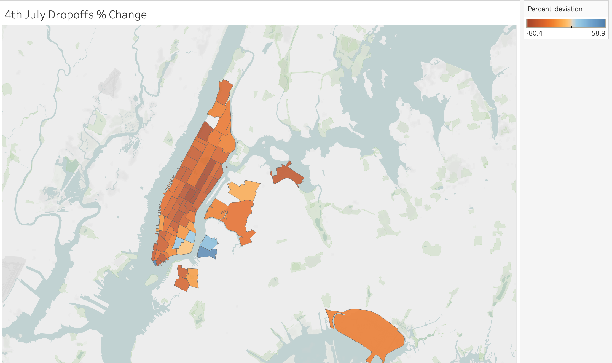
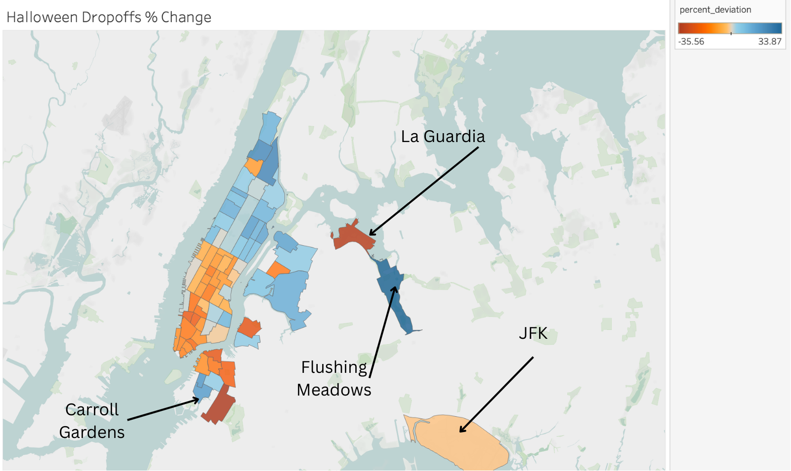
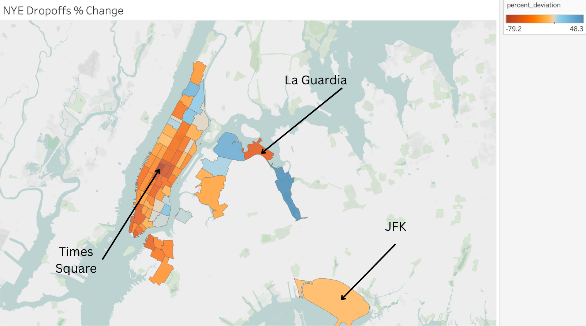

# Holiday Impact on New York City Taxi Usage
Nolan Knievel

## Introduction

One of the greatest perks of going to college in a smaller city is the lack of traffic. I'm originally from Seattle, WA, and have greatly enjoyed not dealing with what was a daily nuisance back home. Life is easier when it's just a 5 minute bike commute to work or school! For this project I was curious to explore traffic behavior in cities. 

New York City is one of the most densely populated and economically activce cities in the world. Millions of residents, commuters, and tourists rely on the city's extensive transportation network each day, which includes subways, buses, commuter rail, rideshare services, and the city's iconic yellow taxis. Among these options, taxis have long served as a flexibly and on-demand mode of transport, and an analysis of taxi behavior can shine light on overall traffic patterns throughout the city. Taxi behavior in NYC can give insignt into commuter habits, and be generalized to other cities as well. 

## Hypothesis

I hypothesized that holidys significantly impact taxi behavior, including total usage and pickup/destination location volume. Holidays can alter work schedules, tourism levels, nightlife activity, and travel throughout the city. I think all of this could lead to changes in taxi ridership that differ significantly from typical weekday or weekend patterns, and help us better understand ridership behavior overall. 

## Data

To analyze taxi behavior, I’m using a dataset containing every taxi ride taken in New York City in 2019. The set includes taxi ride pickup and dropoff region, trip duration, trip distance, fare, passenger tip, and passenger count. Pickup and dropoff locations refer to one of 255 numbered taxi regions within the city.

I'll first illustrate holiday impact by tracking ridership count by day throughout the year. We can define a weekday's expected ridership count as that day's average count over the year and illustrate each day's deviation from expected count on a calendar heatmap for 2019.

We can see some hotspot days, but more notably a number of days where demand signifciantly drops. 

Actual ride counts falls significantly beneath expected ride counts on these holidays thoughout the year:  
- February 18th-21st - President's day
- April 19-21st - Good Friday / Easter Sunday
- May 25-27th - Memorial Day Weekend
- July 4th - Independence Day
- September 1st/2nd - Labor Day Weekend
- October 14th - Columbus / Indigenous People's Day
- November 28th - Thanksgiving
- December 24-27th - Christmas
- Dec 31st / Jan 1st - New Year's

There are also some anomaly days with lowered ridership, despite not being a holiday: 
- March 4th - weather?
- March 18th-20th - Public school spring break?
- March 25th-29th - Public school spring break?
- June 30th - WorldPride March
- August 29th/30th - Pre-labor day travel

Some of these are non-holiday events influencing riding patterns. For example, on June 30th, 2019 New York City held the WorldPride March which featured a massive parade with over 150,000 participants. The drop on March 4th can be explained by a major snowstorm in the Northeast, resulting in school and work closures. There is no obvious driver for the decreased ridership in late March, but my best guess is it is due to public school spring break disrupting normal city movement.

Not all holidays necessarily decreaase ridership though. Halloween for example doesn't demonstrate any large change in ride count. Halloween doesn't disrupt work and festivities happen at night, so it makes that it doesn't disrupt overall ride count. However, it is evident that many holidays will cause a significant decrease in ride count. 

I next graphed hourly patterns for different days. It's useful to first establish a baseline for normal taxi demand throughout the week. The graph below shows ride counts for a random week from the year: January 14-20th. This week appears to be a typical workweek in 2019 without any major external influences. 

We can see greatest activity before and after working hours: 6-9am in the morning and 4-9pm in the afternoon. People's commutes to and from work show in the data which I think is kind of funny since taking taxis every day is definitely not a cost effective way to commute. 

Saturday and Sunday don't see spikes at commuting hours, and see the least demand throughotu the day in general. The busiest night activity happens on Saturday and Sunday, 12-4am. These times equate to Friday and Saturday nights out since these times are after midnight. 

Tuesday (barely) sees the most demand for morning rides and Thursday at 5pm sees the week's peak demand for taxi rides.

These patterns highlight the strong influence of the traditional work week on taxi usage. 

I next created the same graph but with popular holidyays instead of these days in January. The 'average monday' line is the average of hourly ride counts across all mondays thorughout the year and gives a good baseline to compare the holidays to. 

When we compare specific holidays to the baseline weekday patterns, several interesting trends emerge.

Halloween fell on a Thursday in 2019 and pretty closely mirrors our average monday thorughout the day. Later on Halloween shows more use at night, probably from families going trick-or-treating or people riding to halloween parties.

January 1st sees almost rush hour levels of ridership at 1am and has raised levels of rides until 5am. 

Christmas day, Thanksgiving, July 4th, and new year's day all have relatively flat, low ridership during the day. 

Major holidays such as Christmas and Thanksgiving show significantly reduced activity during morning commute hours, indicating that fewer people are traveling to work. However, demand often increases later in the day as people travel to gatherings or holiday events. New Year’s Eve shows a different pattern entirely, with unusually high late-night ridership reflecting celebrations and nightlife across the city. These differences illustrate how holidays shift transportation demand away from work-related commuting and toward social travel. 

Next we can analyze actual locations associated with taxi rides. 

Similar to the calendar heatmap, we'll define a taxi zone's expected ride count as the avergage count of trips for a given day of the week. Mapping the % change from expected zone ride counts give interesting results for different holidays. The following map displays the % change in ride pickups for zones on the 4th of July. 

We can see much of Manhattan painted in red. This aligns with our earlier observations that the city sees decreased ridership on the fourth. Despite overall decreased ridership, some zones see significant increases in ride activity too. As it turns out, the Macy's Fourth of July Firworks event was held on a barge on the East River in 2019. The crowds in neighboring zones likely reflects people traveling to watch the display. It also appears that there was an event at Battery Park, and in the Lower East Side zone, though I couldn't find any obvious culprits in my research. 

I also mapped % change in ride dropoffs per zone on the 4th of July...

It turns out the dropoffs map looks almost identical to pickups. I assume that if you take a taxi somewhere, you're likely to take a taxi home as well, which creates matching dropoff and pickup maps. The same happens for other holidays, so we'll just map dropoffs from now on. 

The next graph shows % change from expected ridership per zone on Halloween. 

Unlike some of the other holidays analyzed, Halloween shows a more distributed pattern of taxi activity. Some rarely visited neighborhoods, like Flushing Meadows and Carroll Gardens,  get a significant increase in taxi rides, presumably from families traveling for trick-or-treating. Interestingly, zones in the North half of manhattan all have increases in ride coutns, while most zones in the south half have decreases. La Guardia Airport also has a significant 33% decrease in ride count on this day, but JFK Airport only has a 2% decrease. 

New Year's Eve also shows some shifts in traffic, but not necessarily how you would expect. Some bordering neighborhoods in northern Manhattan and Flushing Meadows have increased ride counts. Again, like halloween La Guardia has a pretty steep decrease in rides (50%), and JFK has a 9% decrease in ride count. La Guardia appears to be more susceptible to ride impact than JFK. 

Funny enough, the Times Square zone sees one of the greatest decreases from expected ride count at a whopping 79% decrease. My best guess is rides weren't being offered to much of the zone, or holiday traffic simply can't compete with typical non-holiday volume. 

## Conclusion

Overall, this analysis demonstrates that holidays can significantly alter taxi demand patterns in New York City. Many major holidays, including Thanksgiving and Christmas, lead to noticeable reductions in overall ridership as normal commuting activity decreases. Holidays will also significantly impact hourly ride traffic as well. 

By comparing daily, hourly, and geographic patterns, we can see that holidays primarily influence transportation in two ways. Holidays reduce work-related commuting while increasing leisure-oriented travel. These shifts are reflected not only in total ride counts but also in when and where taxi rides occur. 
